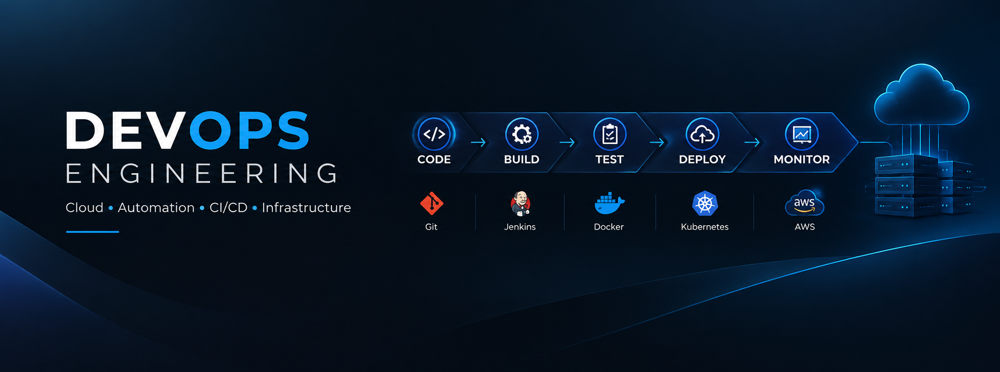

<h1>Hi 👋, I'm Aniket Karhale</h1>

<h3>BCA 3rd Year Student | Aspiring DevOps Engineer | Cloud & Automation</h3>

Building practical skills in Linux, Git, CI/CD, Cloud, Containers and Automation.

---

## 👨‍💻 About Me

🎓 BCA 3rd-year student building a career in **DevOps & Cloud Engineering**

🐧 Hands-on with **Linux, Git, GitHub, Jenkins, Maven and Nginx**

⚙️ Interested in **CI/CD, automation, containers and cloud infrastructure**

☁️ Currently expanding my knowledge of **AWS, Docker, Kubernetes and Terraform**

🚀 Focused on learning by building practical projects and deployment workflows

---

## 🛠️ Tech Stack

---

## 🚀 Featured Projects

### 🔄 GitHub → Jenkins → Maven → Tomcat

**Tech:** GitHub • Jenkins • Maven • Java • Tomcat • Linux

Built a CI/CD workflow where source-code changes in GitHub trigger Jenkins builds and a Java application is prepared for deployment on Tomcat.

**Highlights**
- GitHub Webhook integration
- Jenkins automated builds
- Maven build automation
- Java application deployment workflow
- Linux-based deployment environment

---

### 🌐 Linux Web Server & Multi-Website Hosting

**Tech:** Linux • Nginx • HTML • CSS • Networking

Configured Nginx on Linux and practiced hosting multiple websites using separate server configurations.

**Highlights**
- Nginx web server configuration
- Multiple website hosting
- IP and port configuration
- HTTP/HTTPS fundamentals
- Firewall and LAN connectivity

---

### 🎓 Student Career, Internship & Skill Management System

**Tech:** HTML • CSS • JavaScript • Bootstrap • Java • Spring Boot • MySQL

A college project designed to connect students, companies and administrators through a single career and internship management platform.

**Key Modules**
- Student profile & skills
- Resume & certificates
- Job and internship listings
- Application tracking
- Company recruitment
- Admin management

---

## 📚 DevOps Journey

| Area | Current Focus |
|---|---|
| 🐧 Linux | Administration, Networking, Shell |
| 🔀 Git | Version Control & GitHub |
| ⚙️ CI/CD | Jenkins & Automation |
| ☕ Build | Maven & Java |
| 🌐 Servers | Nginx & Tomcat |
| 🐳 Containers | Docker |
| ☸️ Orchestration | Kubernetes |
| ☁️ Cloud | AWS |
| 🏗️ IaC | Terraform |

---

## 🎯 Currently Learning

- ☁️ AWS Cloud Infrastructure
- 🐳 Docker & Containerization
- ☸️ Kubernetes
- 🏗️ Terraform
- ⚙️ Advanced Jenkins CI/CD
- 📊 Monitoring & Observability

---

## 📊 GitHub Statistics

---

## 🔥 GitHub Streak

---

## 📈 Contribution Activity

---

## 💡 DevOps Philosophy

> **Learn → Build → Automate → Improve**

---

### 🚀 Learning. Building. Automating.

 

